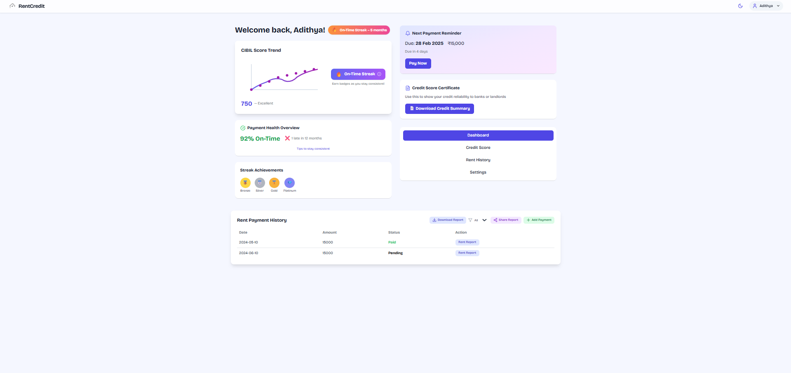
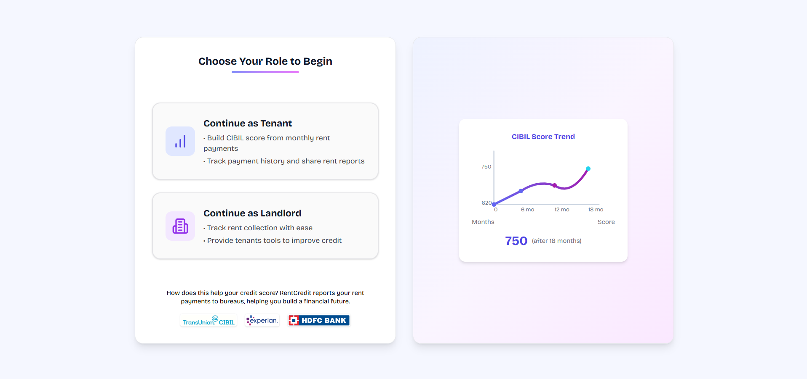
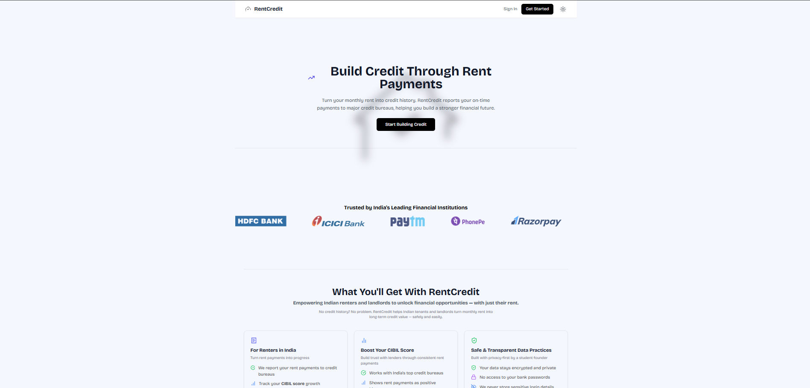

# RentCredit — Rent-based Credit Building & Landlord Dashboard

🔗 **Live demo:** https://rentcredit0.netlify.app/

A modern fintech single-page app that helps tenants build credit history from rent payments while giving landlords simple tools to manage tenants and payments.

---

## Problem we solve
In many rental markets, rent payments do not contribute to tenants' credit histories. Tenants who pay reliably receive little formal credit recognition, and landlords lack streamlined tools to manage rents and tenant relationships. RentCredit simulates credit-building via rent history and provides actionable dashboards for both tenants and landlords.

---

## Key features
- Role-based access for tenants and landlords  
- Secure authentication with Firebase Auth  
- Responsive UI with light/dark mode  
- Tenant tools: rent streaks, simulated credit score, payment history  
- Landlord tools: tenant management, payment confirmations, insights  
- Demo mode with mock data (no backend setup required)  
- Clean, modular React codebase

---

## Tech stack
- **Frontend:** React (Vite), Tailwind CSS  
- **Animations:** Framer Motion  
- **Backend:** Firebase Auth + Firestore  
- **Hosting:** Netlify  
- **Tooling:** Node.js, npm

---

## Live demo & screenshots
**Live demo:** https://rentcredit0.netlify.app/







---

## Architecture (high level)

```

[Browser SPA (React)]
↕ Web client (Firestore SDK / REST)
[Firebase Auth]  <- authentication
[Firestore]      <- user profiles, payments, analytics

```

Component flow:

```

Client
├─ AuthContext
├─ Pages
│   ├─ /login
│   ├─ /tenant-dashboard
│   └─ /landlord-dashboard
└─ Components (Cards, Charts, Modals)

```

---

## Project structure

```

src/
├─ assets/        # images, icons
├─ components/    # reusable UI components
├─ context/       # AuthContext, RoleContext
├─ pages/         # dashboard & auth pages
├─ services/      # firebase.js, helpers
├─ utils/         # formatters, utilities
└─ index.css      # Tailwind styles

````

---

## Getting started (development)

### Prerequisites
- Node.js (v16+)  
- npm or yarn  
- Optional: Firebase project for full functionality

### Install & run

```bash
git clone https://github.com/your-username/rentcredit.git
cd rentcredit
npm install
npm run dev
````

### Build & preview

```bash
npm run build
npm run preview
```

---

## Environment / production notes

To use a real Firebase backend:

1. Copy `.env.example` → `.env`
2. Add Firebase config values:

```
VITE_FIREBASE_API_KEY=...
VITE_FIREBASE_AUTH_DOMAIN=...
VITE_FIREBASE_PROJECT_ID=...
```

For the public demo, mock data is used so the app works without backend keys.

---

## How the demo mode works

Demo mode loads mock tenant/landlord data and disables write operations, allowing quick exploration without authentication or backend configuration.

---

## What I learned / engineering decisions

* Designing clean role-based UI flows
* Reducing Firestore reads through simple schema optimizations
* Using demo mode to improve accessibility and testing
* Deploying a Vite SPA cleanly via Netlify

---

## Measurable trade-offs & limitations

* Credit score is simulated (not tied to real bureaus)
* Firestore rules require further hardening
* Payment actions are mocked; no real gateway integration

---

## Roadmap / next steps

* Add payments provider + sandbox
* Cloud Functions for notifications and server-side logic
* Improved analytics and retention metrics
* PWA support
* Admin analytics dashboard

---

## Contributing

1. Fork the repo
2. Create a feature branch
3. Open a PR describing your changes

---

## Contact

**Author:** Adithya Sivakumar 

**Email:** [adithya2410402@ssn.edu.in](mailto:adithya2410402@ssn.edu.in) 

**LinkedIn:** [https://linkedin.com/in/adithyasivakumar](https://linkedin.com/in/adithyasivakumar) 

---

## License

MIT © 2025 Adithya Sivakumar


